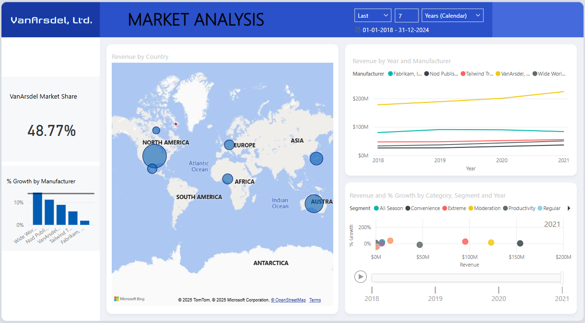
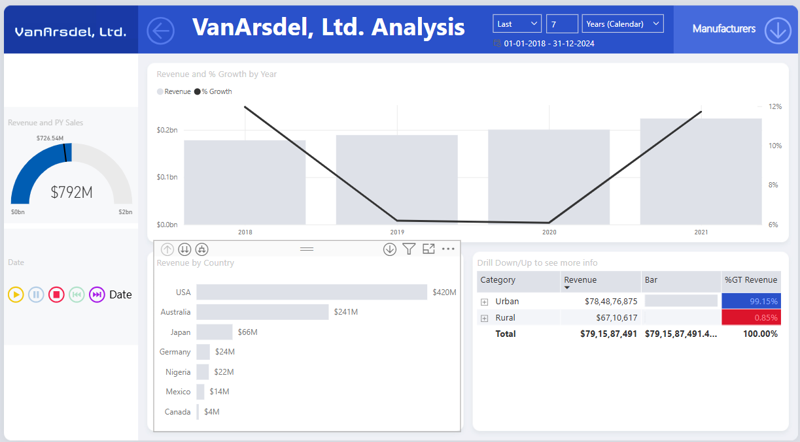

# 📊 Power BI Revenue & Growth Dashboard

An interactive Power BI dashboard designed to visualize and analyze product revenue and growth performance across various dimensions.

## 🔍 Project Overview

This dashboard was built using a dataset that includes:
- **Products**
- **Manufacturers**
- **Sales**
- **Growth**

It provides insights into revenue and growth trends segmented by:
- Year
- Country
- Market segment
- Manufacturer

## 🧩 Key Features

- 📈 **Visual Elements**:  
  Bar charts, stacked bar charts, line charts, scatter plots, cards, maps, and gauges

- 🧭 **Interactivity**:  
  Buttons, selection panes, and slicers for seamless filtering and navigation

- 📊 **Insight Highlights**:  
  Year-over-year growth, top-performing countries and segments, and manufacturer comparisons

## 🖼️ Dashboard Previews

> 
> 

## 🚀 How to Use

1. Clone the repository
2. Open the `.pbix` file in Power BI Desktop
3. Interact with the filters and visuals to explore the data

## 📁 Files Included

- `Revenue_Growth_Dashboard.pbix` – Main Power BI file
- `previews/` – Folder for dashboard previews
- `data/` - Folder for data source files
- `README.md` – Project documentation
- `LICENSE` - License file

## License
This project is open-source and available under the [MIT License](./LICENSE).

## 📬 Contact

Feel free to connect with me on [LinkedIn](https://ca.linkedin.com/in/natashabhateja) or reach out via [GitHub](https://github.com/natashabhateja) for collaboration or feedback.

---
